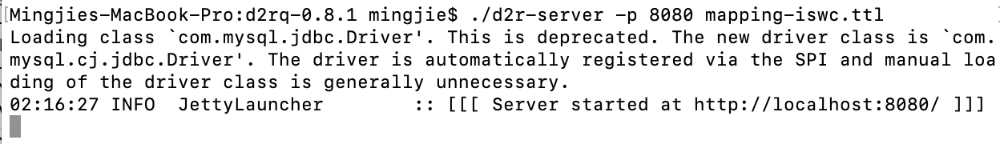

# Hands-on with D2RQ

Author: Mingjie Ye

## 0. Environment

- System: MacOS
- MySQL 8.0.15
- D2RQ 0.8.1
- Java 1.8

## 1. Introduction
The topic I chose in the Seminar 1 is about RDB2RDF and query a non-RDF database using SPARQL. My hands-on work is based on D2RQ which is a platform for accessing relational database as RDF ways. In this work, I create a relational database in MySQL and use SQL to SELECT some data. Then we run D2R server from the command line to execute the D2RQ mapping. We could access querying in HTML browsers or command line. The results are clearly showed in the page.

## 2. Installation
D2RQ is available in its website [http://d2rq.org/#compatibility](http://d2rq.org/#compatibility)

D2RQ supports many relational databases:

- Oracle
- MySQL
- PostgreSQL
- SQL Server
- HSQLDB
- Interbase/Firebird

Here, I chose MySQL as the relational database. The installation of MySQL is easy with the document of MySQL tutorial [https://dev.mysql.com/downloads/installer/](https://dev.mysql.com/downloads/installer/).

In order to access database, we need JDBC driver which is a software component enabling a Java application to interact with a database. We could download MySQL JDBC driver named Connector/J from the official website [https://dev.mysql.com/downloads/connector/j/](https://dev.mysql.com/downloads/connector/j/). Then place the **mysql-connector-java-8.0.15.jar** file into '**/d2r-server-0.7/lib/**'


## 3. Running
### 3.1 Run MySQL
First, we open mysql in Preference.


Here, I use root as my username and 12345678 as my passwor and use the database from the ISWC 2002 conference [available here](http://d2rq.org/example/iswc-mysql.sql) as an exammple. 
I add some lines in this sql file in order to create a database "iswc" in mysql first and use iswc. So the sql file here is slightly different.

Then in command line:
`mysql -u root -p < iswc-mysql.sql`


See our databases, tables and execute a simple SELECT in MySQL.


The result is showed in command line. 
### 3.2 D2RQ

Now we are going to mapping this relational database into RDF way and query by SPARQL language.

First, we have to generate a mapping file for our database schema using the [generate-mapping](http://d2rq.org/generate-mapping) tool. It's like 

```
generate-mapping -o mapping.ttl -d driver.class.name
    -u db-user -p db-password jdbc:url:...
```

Here, we use this [mapping file](). Pay attention to the username and password in the file. You need change them to yours before mapping.


Then, run it by using
```
./d2r-server -p 8080 mapping-iswc.ttl
```



Open http://localhost:8080/ in browsers.


Turn to http://localhost:8080/snorql/ to use SPARQL.


In the 3.1, I use `select FirstName, LastName, email from persons;` in MySQL and get some results. Here, I use SPARQL to achieve the same query and get the same results.


The results could also be saved as JSON, XML or XML+XSLT. For example, the JSON form of the query in this case is:

```JSON
{
  "head": {
    "vars": [ "name" , "email" ]
  } ,
  "results": {
    "bindings": [
      {
        "name": { "type": "literal" , "value": "Yolanda Gil" } ,
        "email": { "type": "uri" , "value": "mailto:gil@isi.edu" }
      } ,
      {
        "name": { "type": "literal" , "value": "Varun Ratnakar" } ,
        "email": { "type": "uri" , "value": "mailto:varunr@isi.edu" }
      } ,
      {
        "name": { "type": "literal" , "value": "Jim Blythe" } ,
        "email": { "type": "uri" , "value": "mailto:blythe@isi.edu" }
      } ,
      {
        "name": { "type": "literal" , "value": "Andreas Eberhart" } ,
        "email": { "type": "uri" , "value": "mailto:eberhart@i-u.de" }
      } ,
      {
        "name": { "type": "literal" , "value": "Borys Omelayenko" } ,
        "email": { "type": "uri" , "value": "mailto:borys@cs.vu.nl" }
      } ,
      {
        "name": { "type": "literal" , "value": "Andy Seaborne" } ,
        "email": { "type": "uri" , "value": "mailto:andy.seaborne@hpl.hp.com" }
      } ,
      {
        "name": { "type": "literal" , "value": "Alberto Reggiori" } ,
        "email": { "type": "uri" , "value": "mailto:areggiori@webweaving.org" }
      } ,
      {
        "name": { "type": "literal" , "value": "Sonia Bergamaschi" } ,
        "email": { "type": "uri" , "value": "mailto:bergamaschi.sonia@unimo.it" }
      } ,
      {
        "name": { "type": "literal" , "value": "Francesco Guerra" } ,
        "email": { "type": "uri" , "value": "mailto:guerra.francesco@unimo.it" }
      } ,
      {
        "name": { "type": "literal" , "value": "Christian Bizer" } ,
        "email": { "type": "uri" , "value": "mailto:chris@bizer.de" }
      }
    ]
  }
}
```

Another example of query using SPARQL is "Select people who wrote papers on the topic 'Semantic Web'":

```sqarql
SELECT DISTINCT ?personName ?paperTitle  WHERE {
  ?paper dc:creator ?person .
  ?person foaf:name ?personName.
  ?paper dc:title ?paperTitle  .
  ?paper skos:subject ?topic.
  ?topic rdfs:label ?topicName .
  FILTER (?topicName = "Semantic Web")
}
```
The result is showed as the figure below.


Besides d2r-server, we could also use d2r-query to run a SPARQL query from the command line:

```
d2r-query mapping.ttl "SELECT * { ?s ?p ?o } LIMIT 10"
```

or

```
d2r-query mapping.ttl @query.sparql
```


## 4. Reference
- D2RQ platform http://d2rq.org/#compatibility
- D2R Server tutorial http://vadimeisenberg.github.io/d2rq/tutorial.html
- MySQL Connector/J https://dev.mysql.com/downloads/connector/j/

